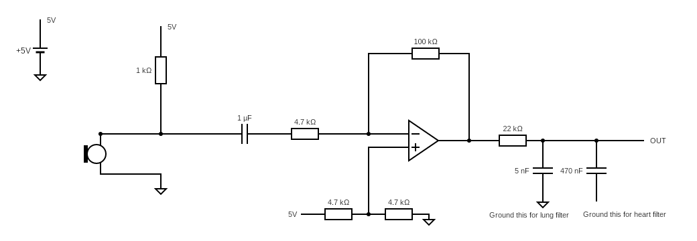

# Electric Stethoscope

This project is a simple electric stethoscope that can be used to listen to the body sounds of a patient. Prepared for AGU SAPA capsule final project.

# Pre-requisites

## Hardware
- Arduino Uno
- 2 wire electret microphone
- Doctor's stethoscope
- Resistors
    - 1 x 1kΩ
    - 1 x 4.7kΩ
    - 2 x 10kΩ
    - 1 x 22kΩ
    - 1 x 100kΩ
- Capacitors
    - 1 x 5nF
    - 1 x 470nF
    - 1 x 1uF
- 1 x Low-Noise Operational Amplifier (1 x NE5532)
- Breadboard
- Jumper wires
- Optional:
    - Soldering iron and its accessories
    - Pertinax board to solder the circuit (or you can simply buy a PCB)
    - 3D printer to print the box for the circuit

## Software
- Arduino IDE
- LTspice
- Node.js 20 or higher
- Visual Studio Build Tools 2017 or higher
- Python 3.6 or higher
- Yarn 1.22.22

# Running the project
- Clone the repository
- Open the Arduino IDE and upload the `StandartFirmataPlus` file to the Arduino Uno
    - File -> Examples -> Firmata -> StandartFirmataPlus
    - Or simply open the `StandartFirmataPlus` folder and upload the firmware to the Arduino Uno
- Build the circuit following the [circuit diagram](https://crcit.net/c/c403772aff41427b846746d022f3cfba)
- Run backend server, see the [be](be/README.md) for more information
- Run frontend server, see the [fe](fe/README.md) for more information
- Open the `localhost:3000` on your browser
- Enjoy!

# Circuit Diagram

# Authors
- [Barış DEMİRCİ](hi@338.rocks)
- Selin Nisa AKGÖL
- Nuri İNCEÖZ
